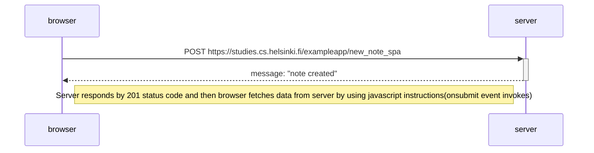

```mermaid
sequenceDiagram
    browser->>+server:POST https://studies.cs.helsinki.fi/exampleapp/new_note_spa
    server-->>-browser: message: "note created"

    Note right of browser: Server responds by 201 status code and then browser fetches data from server by using javascript instructions(onsubmit event invokes)
    
```