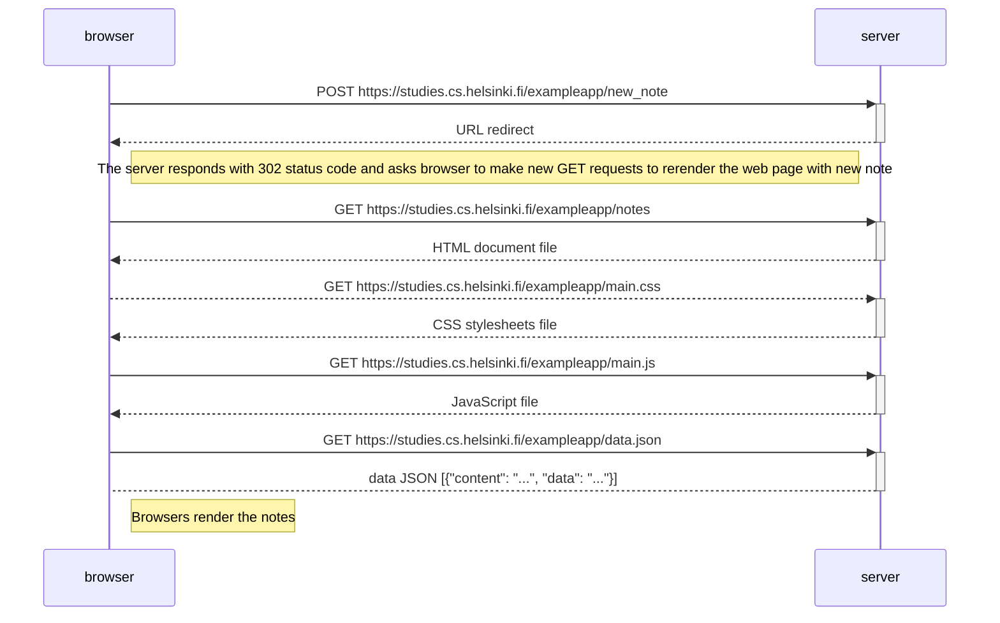

```mermaid
sequenceDiagram
    browser->>+server:POST https://studies.cs.helsinki.fi/exampleapp/new_note
    server-->>-browser: URL redirect

        Note right of browser: The server responds with 302 status code and asks browser to make new GET requests to rerender the web page with new note

    browser->>+server: GET https://studies.cs.helsinki.fi/exampleapp/notes
    server-->>-browser: HTML document file

    browser-->>+server: GET  https://studies.cs.helsinki.fi/exampleapp/main.css
    server-->>-browser: CSS stylesheets file 

    browser->>+server: GET https://studies.cs.helsinki.fi/exampleapp/main.js
    server-->>-browser: JavaScript file

    browser->>+server: GET https://studies.cs.helsinki.fi/exampleapp/data.json
    server-->-browser: data JSON [{"content": "...", "data": "..."}]

        Note right of browser: Browsers render the notes
    
```